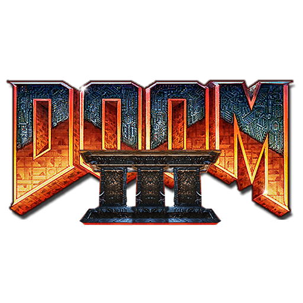

# Doom 3 (boom3)

### Description

boom3 is a source code port of the Doom 3 codebase.

See the documentation for a list of required files.

### License

GPLv2

### Icon

### Fanart

Help make me fanart!

### Screenshots

Help make me screenshots!
